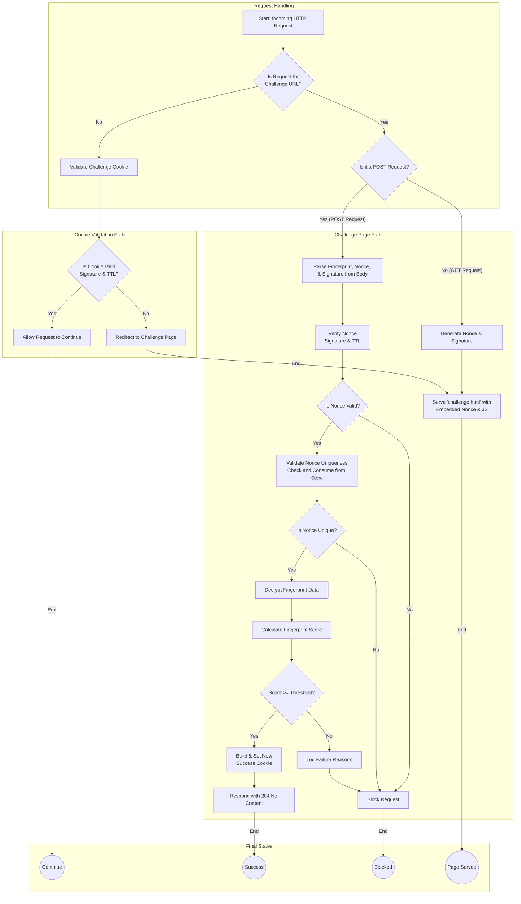

# Pingap Challenge


### 1. Overview

The **Challenge plugin** is a powerful security module for the Pingap proxy framework, designed to mitigate automated bots and ensure that traffic is generated by legitimate web browsers.

It operates by issuing a client-side JavaScript challenge to visitors who have not yet been verified. This challenge performs a browser fingerprint analysis. If the client's fingerprint score meets a configurable threshold, they are granted a temporary, signed "clearance cookie," allowing them to access the protected resources. This process effectively filters out simple scripts and less sophisticated bots without imposing a significant burden on real users.

### 2. Features

* **Client-Side Browser Verification**: Utilizes a JavaScript-based fingerprinting agent to assess the client's environment.
* **Protection Against Replay Attacks**: Employs a single-use, time-limited nonce for each challenge to ensure that a solved challenge cannot be reused.
* **Configurable Security**: Allows customization of cookie names, expiration times (TTL), and the required fingerprint score.
* **HMAC-SHA256 Signing**: All clearance cookies and nonces are cryptographically signed to prevent tampering.

### 3. How It Works

The plugin follows a robust, multi-step validation flow:

1.  **Cookie Validation**: For every incoming request, the plugin first checks for the presence of a valid and unexpired clearance cookie (e.g., `pingap_challenge`). It verifies the cookie's HMAC signature to ensure it was issued by the server and has not been altered.
2.  **Allow or Redirect**:
    * If a valid cookie is found, the request is deemed legitimate and is allowed to proceed to the upstream server (`RequestPluginResult::Continue`).
    * If the cookie is missing, invalid, or expired, the user is redirected to the configured Challenge URL (e.g., `/challenge-endpoint`).
3.  **Challenge Issuance**: When a client is redirected to the Challenge URL, the server serves a self-contained HTML page. This page includes:
    * The fingerprinting JavaScript library.
    * A unique, single-use **Nonce** (a UUIDv7) and a **Signature**, which are embedded into the page for the client-side script to use.
4.  **Client-Side Execution**: The client's browser executes the JavaScript, which:
    * Collects a detailed browser fingerprint.
    * Submits the fingerprint data, the original nonce, and the signature to the server via a `POST` request to the same Challenge URL.
5.  **Server-Side Verification**: The server receives the `POST` request and performs a series of critical checks:
    * **Nonce Verification**: It validates the nonce's signature and timestamp to ensure it's authentic and not expired. It then checks against an internal LRU cache (`TtlLruLimit`) to guarantee the nonce has not been used before, preventing replay attacks.
    * **Fingerprint Scoring**: If the nonce is valid, the server decrypts and analyzes the submitted fingerprint data, calculating a risk score based on numerous environmental characteristics.
6.  **Cookie Issuance**:
    * If the calculated score is **above or equal to the `threshold`**, the challenge is passed. The server responds with a `204 No Content` status and sets a new, signed clearance cookie in the client's browser. The client-side logic then typically reloads or redirects to the original destination.
    * If the score is **below the `threshold`**, the challenge fails. The server responds with an error, and no cookie is granted.




### 4. Configuration

To use the Challenge plugin, you need to add it to your Pingap configuration file. Below is an example configuration and a detailed breakdown of all available parameters.

#### Example Configuration (TOML format)

```toml
# In your pingap configuration file
[plugins.browserChallenge]
category = "challenge"
cookie_name = "app_clearance_token"
secret = "a_very_strong_and_long_random_secret_key"
url = "/pingap-challenge"
ttl = "1h"
threshold = 60
nonce_ttl = "15s"
```

Configuration Parameters

| Parameter   | Type            | Required | Default Value      | Description                                                                                                                                     |
| ----------- | --------------- | -------- | ------------------ | ----------------------------------------------------------------------------------------------------------------------------------------------- |
| secret      | String          | Yes      | -                  | A cryptographically strong secret key used for all HMAC-SHA256 signing operations. Must be kept confidential.                                   |
| url         | String          | Yes      | -                  | The specific URL path for serving the challenge HTML (via GET) and handling the fingerprint submission (via POST).                              |
| cookie_name | String          | No       | "pingap_challenge" | The name of the clearance cookie that will be set in the user's browser after successfully passing the challenge.                               |
| ttl         | Duration String | No       | (Session Cookie)   | The lifespan of the clearance cookie. Accepts formats like 10s, 30m, 1h, 1d. If not provided, the cookie expires when the browser session ends. |
| threshold   | Integer         | No       | 60                 | The minimum score (from 0 to 100) that the browser fingerprint must achieve to pass the validation. Higher values are stricter.                 |
| nonce_ttl   | Duration String | No       | "10s"              | The lifespan of the single-use nonce. This defines the time window a user has to solve and submit the challenge.                                |

